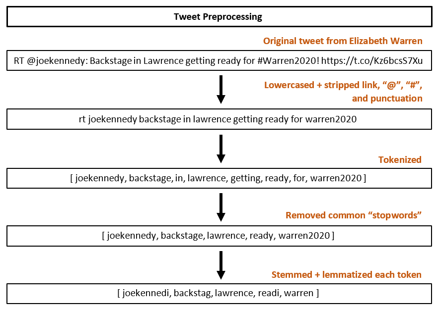
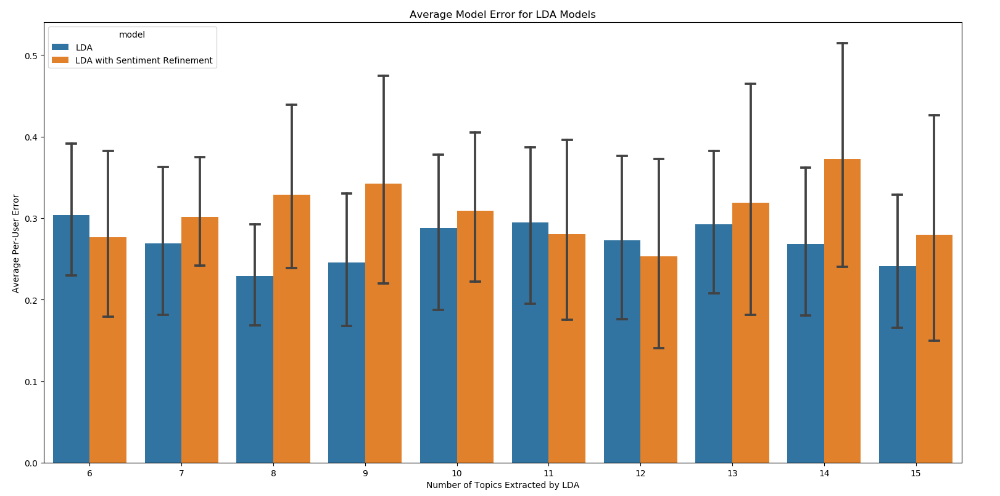

# Political Alignment Analysis in 140 Characters

#### CX 4240, Spring 2019

#### Jessica Buzzelli, Jarad Hosking, Aakanksha Patil

# I: Problem

Twitter is a social media platform where users' status updates (tweets) can have the ability to impact how their followers percieve events, [especially in the realm of politics](https://www.nytimes.com/2019/04/11/us/politics/on-politics-twitter-democrats.html). In this project, we wanted to see how accuractely we could identify users' political affiliations, with the goal of making a model that could be applied to identify like-minded public figures to a given user.

With [Twitter's ongoing decline in monthly users](https://www.bloomberg.com/news/articles/2018-07-27/twitter-projects-users-to-decline-profit-short-of-estimates), we hypothesize that such a tool could be used to further establish the site as a more specialized hub for political news and debate and, in turn, drive platform-unique content and reinvigorate overall site traffic. __Another high potential use case could involve matching individuals with similarly-aligned local politicians in order to inspire more people to participate in non-federal elections.__

# II: Approach

In order to meaningfully visualize our model projections, we chose to use a Nolan Chart as our frame of reference. We extracted ground-truth information on training users (politicians) from <a href="">OnTheIssues.org</a>, and solved for unknown scores of our test users.

An example of a Nolan Chart from our source mapping Donald Trump to a point at (.8,.2):

Our problem lies somewhere between a clustering and a classification problem:

1.  We want to know which users are most similar to a test user, but
2.  Our classification "labels" are non-discrete, and
3.  We wanted to project onto a space where we can bring prior knowledge on political parties, schools of thought into our interpretation of the data

# III: Dataset

Since Twitter frowns upon (but allows) its data being used to identify users based on federally protected classes such as political alignment, we have limited our test set of data to users whose public presences are based around their political commentary -- we refer to them collectively in this project as pundits.

Using a [Twitter API Python client](http://www.tweepy.org/) and an [SQLite](https://www.sqlite.org/index.html) database, we were able to pull tweets from a collection of politicians and pundits with the following characteristics.

**NOTE:** We were not able to obtain as many training users (politicians) as ideal due to the lack of politicians with Twitter accounts active enough to have more than 2,000 tweets since the 2016 presidential election (a limit we saw necessary in case of changes in political affiliation over time). We had no problem finding active pundits on the platform, but restrained our test numbers to scale well with our set of politicians.

Nolan quadrant breakdown of dataset:

**NOTE:** We were unable to find any good examples of populists for our dataset, and therefore would ideally use a different visualization convention if unbiased ground-truth data were similiarly available.

Tweets per user demographic breakdown:

Before composing our feature matrix from the tweets in our database, we cleaned each tweet as follows:

After, we converted each cleaned tweet into a sparse vector of [Term Frequency x Inverse Document Frequency (TF-IDF) scores](https://nlp.stanford.edu/IR-book/html/htmledition/tf-idf-weighting-1.html) trained on the politicians' combined corpus. This worked by 1) excluding words not used by the polticians' accounts and to 2) minimizing the weight of words that were rarely used by multiple politicans.

Our feature matricies had **112,483 training records**, **67,056 testing records**, **43,824 unique features** (same number of features in training and testing matricies), and looked something like this:

# IV: Results

### Attempt 1: Full-Feature Linear Regression

A similiar problem used [logistic regression and clustering](https://medium.com/linalgo/predict-political-bias-using-python-b8575eedef13) to predict the bias of newspaper headlines, but we started with a linear regression in order to determine a test users' Nolan coordinates based on their relative term frequencies.

Since we doubted an individual tweet's ability to provide quality insights on a person's overall political affiliation, we ran a cross-validation run with our original matrix as well as with the same matrix reorganized to look like this (**59 training records**, **19 testing records**, **43,824 features**):

We applied no dimensionality reduction methods when achieving the below results:

The better model (where the feature matrix's rows = sum of a users' tweet vectors) had an average error of 24.00 units of distance on the Nolan Chart (the difference of roughly one quadrant) with a standard deviation of 5 units.

### Attempt 2: Feature Engineering via Latent Dirichlet Allocation and Sentiment Data

Unlike [similar projects](https://medium.com/analytics-vidhya/twitter-sentiment-analysis-for-the-2019-election-8f7d52af1887) [using Twitter data for sentiment analysis](https://ieeexplore.ieee.org/document/6897213), we tried to reduce our number of features in a more meaningful way via topic-sentiment analysis.

Approaching the problem intuitively, we decided that a person's political affiliation is a combination of:

1.  The topics they care about (or in this case, tweet about most frequently), and
2.  Their sentiments (in this case, positive, negative, or neutral) towards those topics

Using [Vader sentiment analyser](https://www.nltk.org/_modules/nltk/sentiment/vader.html) since it was trained for [assigning a sentiment polarity score to social media language with support for emojis, common slang, and double-negation](https://medium.com/@sharonwoo/sentiment-analysis-with-nltk-422e0f794b8), we proceded as follows:

Of course, we also ran a "one vs. rest" cross validation on an LDA model that did not use the sentiment approach detailed above:

Cross validation results of the sentiment-enabled model were even more clustered than seen in Attempt 1:

# V: Conclusion

Considerations:

*   Sentiment data may have not been the most accurate given sarcasm, passive agressiveness aimed at other users, etc.
*   Very skeptical on the scalability of the regression model in Attempt 1 due to the vast number of features compared to data points; very volatile basis for a model
*   Interestingly though, regression did not perform better when using PCA to reduce the number of features on either setup for the feature matrix
*   Topic-based models (Attempt 2) did not perform better when using feature reduction via Latent Semantic Indexing (LSI, or LDA with truncated SVD); much worse even when reducing the number of topics
*   Concerned about the very probable possibility of users not tweeting as we would expect given a certain alignment; need to get multiple users in our dataset who map to the same point to bring stability
*   Regression as a means of projecting onto the chart was tricky since we lacked enough datapoints at the extremes of the chart to be able to place users towards the corners